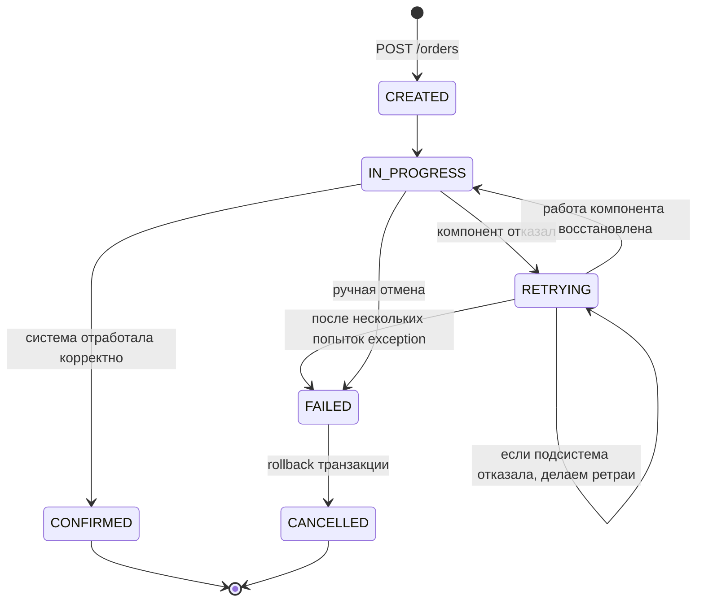

```mermaid
stateDiagram-v2
    [*] --> CREATED: POST /orders
    CREATED --> IN_PROGRESS
    IN_PROGRESS --> CONFIRMED: система отработала корректно
    IN_PROGRESS --> RETRYING: компонент отказал
    RETRYING --> IN_PROGRESS: работа компонента восстановлена
    RETRYING --> RETRYING: если подсистема отказала, делаем ретраи
    RETRYING --> FAILED: после нескольких попыток exception
    IN_PROGRESS --> FAILED: ручная отмена
    FAILED --> CANCELLED: rollback транзакции
    CONFIRMED --> [*]
    CANCELLED --> [*]
```

